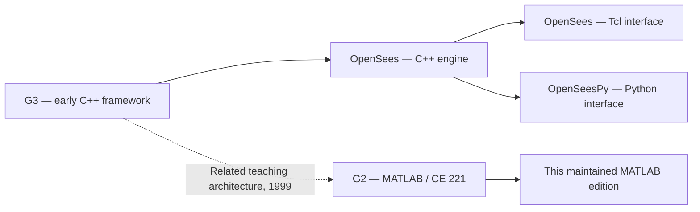
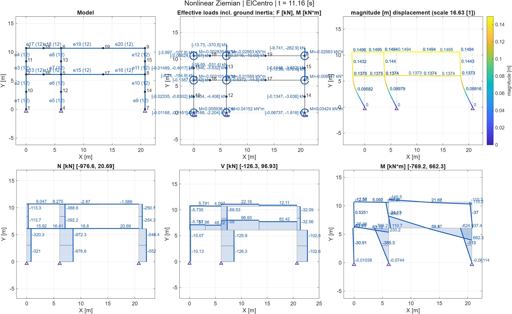
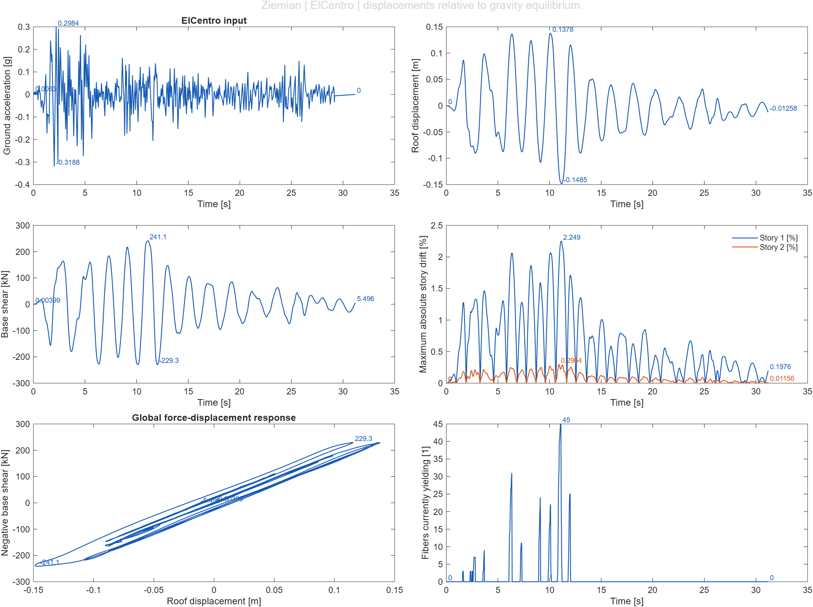

# G2 — MATLAB structural analysis, visualization, nonlinear statics & dynamics

[Public repository](https://github.com/mgrubisic/G2-MATLAB-predecessor-to-OpenSees) · [MIT license](LICENSE.md) · [Visualization](docs/VISUALIZATION.md) · [Dynamics](docs/DYNAMICS.md) · [Units](docs/UNITS.md)

G2 is an educational object-oriented MATLAB framework originally written by **Gregory L. Fenves at UC Berkeley in 1999**. This maintained edition adds visualization, coherent units, nonlinear transient analysis and modal properties to the historical planar element formulations.

The repository name describes G2 as a predecessor to OpenSees. More precisely, G2 was the MATLAB teaching companion of **G3**, the C++ framework that became OpenSees: they shared an architectural approach. G2 is a separate implementation with its own element library. [Prof. Scott's historical account](https://openseesdigital.com/2019/11/07/only-their-mother-can-tell-them-apart/).

## Contents

- [History](#history-g2-g3-and-opensees)
- [Repository layout](#repository-layout)
- [Setup](#requirements-and-setup)
- [Examples](#examples)
- [Analysis and visualization](#analysis-and-visualization)
- [Units](#units)
- [Verification](#verification)
- [GitHub publication](#updating-the-public-github-repository)
- [Credits and sources](#credits-sources-and-license)

## History: G2, G3 and OpenSees

### Architectural origins

The broader history traces the OpenSees architecture to Frank McKenna's 1997 Berkeley doctoral research, supervised by Fenves. The modular design separated model components from analysis algorithms. The framework was called G3 during early PEER development; around 2000 the OpenSees name expressed its role as an extensible earthquake simulation system. [AEC Engineering Hub's historical synthesis](https://aec-hub.mamut-systems.com/en/history-of-opensees/).



The dotted link represents architectural kinship, not conversion of one codebase into the other.

### G2: nonlinear analysis in the classroom

In January 1999 Fenves created G2 for **CE 221 at UC Berkeley**, while OpenSees was still called G3. Its MATLAB code included elastic trusses and beam-columns, nonlinear trusses, two-component beam models, displacement-based and force-based distributed plasticity, wide-flange fiber sections with bilinear materials, and Newton/Modified Newton static procedures.

Michael H. Scott recovered a surviving copy in October 2019 and shared it on GitHub with permission. His account records the original MATLAB 5.0 target and successful use with R2018b. [Only Their Mother Can Tell Them Apart, 2019](https://openseesdigital.com/2019/11/07/only-their-mother-can-tell-them-apart/).

### G3: the early OpenSees landscape

Scott's firsthand account of 1999 describes McKenna's truss, elastic beam-column and uniaxial materials; Remo de Souza's force-based beam-column and fiber sections for CE 224; Fenves's zero-length element; and Scott's C++ ports of Filippou's concrete and steel routines. This initially small collection grew into the larger framework. [Early Landscape of OpenSees, 2020](https://openseesdigital.com/2020/11/07/early-landscape-of-opensees/).

### The broader OpenSees system

OpenSees expanded into structural and geotechnical simulation through a wider research community. Its C++ engine supports replaceable model and analysis components. Tcl was the early scripting interface; OpenSeesPy exposes the engine to Python workflows. These interfaces do not imply that G2 has the same capabilities. [AEC Engineering Hub's history](https://aec-hub.mamut-systems.com/en/history-of-opensees/).

| Period | Development | Connection to G2 |
| --- | --- | --- |
| 1997 | McKenna's Berkeley dissertation | Architectural foundation of the later C++ framework |
| January 1999 | Fenves creates G2 for CE 221 | Origin of the MATLAB classes preserved here |
| 1999 | G3 gains elements, materials and sections | Contemporary development of the related framework |
| Around 2000 onward | OpenSees name and growing community | Separate simulation platform used as a reference |
| October–November 2019 | G2 recovered and shared by Scott | Preservation of the teaching code |
| Maintained edition | Visualization, units, dynamics and modal APIs | Extensions described in this repository |

The timeline follows the three linked accounts: the Scott posts are firsthand recollections, while the AEC Hub article is a secondary synthesis. See also the [UC Berkeley OpenSees manual](https://opensees.berkeley.edu/OpenSees/manuals/usermanual/index.html).

## Repository layout

```text
G2-MATLAB-predecessor-to-OpenSees/
├── README.md                 Overview, history and usage
├── LICENSE.md                Original G2 MIT license
├── setup_g2.m                MATLAB path setup
├── src/
│   ├── @model/               Model, assembly, transient and modal APIs
│   ├── @element*/            Historical planar element classes
│   ├── @wfsection/           Fiber sections and bilinear material
│   ├── +g2dyn/               Integration, loads, mass and time series
│   ├── +g2vis/               Plotting, units, viewer and animation
│   └── *.m                  Static solvers and quadrature utilities
├── EXAMPLES/                 Runnable static and dynamic examples
├── data/earthquakes/          Input recordings and provenance notes
├── docs/                     Detailed technical guides
├── tests/                    MATLAB tests and OpenSeesPy benchmarks
├── scripts/                  Windows publishing utility
└── results/                  Generated outputs; ignored by Git
```

MATLAB `@class`, `+package` and `private` conventions are preserved. Use `setup_g2` instead of recursively adding all subdirectories. Separate OpenSees and OpsVis checkouts in the development workspace are reference projects outside the G2 publishing manifest.

## Requirements and setup

Modern graphics target **MATLAB R2020a or newer**; runtime verification uses **R2026a**. Modern extensions do not target MATLAB 5.0. No Python, OpenSees executable or external MATLAB toolbox is needed for G2 examples, RCM or plotting. Python/OpenSeesPy is optional for reference comparisons; Git and Windows PowerShell are needed for the batch publishing utility.

```sh
git clone https://github.com/mgrubisic/G2-MATLAB-predecessor-to-OpenSees.git
cd G2-MATLAB-predecessor-to-OpenSees
```

Start MATLAB in the repository root:

```matlab
setup_g2;
ziemian_elcentro;
```

`setup_g2` adds `src` and `EXAMPLES` for the current session. Examples initialize their paths too. Start a fresh MATLAB session when switching from an older checkout already on the path.

## Examples

| Command | Analysis | Native units / purpose |
| --- | --- | --- |
| `strongback` | Linear static frame | mm–kN; geometry, deformation, N/V/M, reactions |
| `ziemian` | Original linear static frame | mm–kN; simplified geometry and member A/I |
| `cantilever` | Nonlinear static fiber cantilever | in–kip; fibers, curvature and load history |
| `dynamic_linear` | Damped free vibration | m–kN–tonne–s; mass and modal report |
| `dynamic_earthquake` | Nonlinear fiber column | Synthetic excitation and material yielding |
| `ziemian_elcentro` | Nonlinear preloaded frame | Full ElCentro recording and seismic response |

```matlab
setup_g2;
run_all_examples('results'); % all six examples; PNG, MAT and modal reports
```

### Nonlinear Ziemian / ElCentro

The supplied [record](data/earthquakes/ElCentro.txt) has **1560 samples in g**, **dt=0.02 s**, duration **31.18 s** and PGA **0.31882 g**. Horizontal UniformExcitation converts g to m/s² once with **9.80665**, without additional scaling; TRBDF2 is the default.

Original joints and pinned bases are retained, with two displacement-based fiber elements per member. Ten static steps establish gravity equilibrium. Demonstration assumptions: E=200 GPa, Fy=250 MPa, 1% hardening, steel density 7.85 tonne/m³, 3% Rayleigh damping, and floor line weights **50/35 kN/m**. Floor masses are tributary weight/g, separate from consistent distributed steel mass.

```matlab
[m,r,p,s] = ziemian_elcentro('Plot',false);
[m,r,p,s] = ziemian_elcentro('FloorLoads',[50 35]);
load('results/ziemian_elcentro_results.mat');
ziemian_elcentro_plots(dynamicResult.History,earthquakeSummary);
```

The default run converged without cutbacks and activated material yielding. Approximate peaks: roof displacement **0.14852 m**, base shear **241.07 kN**, story drifts **2.249% / 0.2964%**. These values belong to the stated assumptions. Equivalent rectangular I sections reproduce geometric A/I, subject to fiber discretization; kinematics are small-displacement without P-delta. This is not a validated reproduction of the original published benchmark. Details: [Dynamics](docs/DYNAMICS.md), [record notes](data/earthquakes/README.md).

Selected generated illustrations are tracked as documentation assets; bulk outputs remain in `results`.





## Analysis and visualization

Original static procedures `linearAnalysis`, `simpleNewtonRaphson`, `modifiedNR` and `variableloadNR` remain in `src`. Transient capabilities include:

- Default OpenSees-compatible `g2dyn.trbdf2`, alternating trapezoidal/BDF2 steps with continuation and restart after changed steps or failed trials.
- Optional average-acceleration `g2dyn.newmark(.5,.25)`.
- RCM numbering, sparse assembly, Newton iteration, residual-norm tests, converged-state commits, rollback and cutbacks.
- Constant, Linear, Sine and Path series; Plain and UniformExcitation patterns.
- Concentrated nodal and lumped/consistent element masses; node/element Rayleigh damping using current, initial and committed stiffness factors.

```matlab
[m,r] = transientAnalysis(m,dt,steps,'Patterns',{excitation});
[m,r] = transientAnalysis(m,dt,steps,'Patterns',{excitation}, ...
                         'Integrator',g2dyn.newmark(.5,.25));
modes = modalAnalysis(m,6);
p = modalProperties(m,modes,'-print','-file','results/ModalReport.txt','-return');
```

`modalProperties` returns total/free mass, center of mass, generalized masses, modal participation factors, effective masses and cumulative percentages for MX/MY/RMZ. HRZ diagonalization handles total/free masses; participation uses the original free mass matrix. `-unorm` changes normalization while preserving effective modal masses. [Dynamics](docs/DYNAMICS.md) documents formulas, failure semantics and benchmark qualifications.

The supported scope is planar G2 truss/beam models, not the complete OpenSees 3D, shell/solid, soil, contact, multipoint or multi-support libraries. G2 runs its own MATLAB formulations.

The OpsVis-inspired `+g2vis` package offers geometry/supports, loads/moments, interpolated deformation, displacement colors, N/V/M, reactions, fiber stress/strain/state, curvature, mass, time histories, hysteresis, dashboards, a viewer and GIF animation. Curves are colored; quantities have unit labels and default annotations; legends are transparent with `Box='off'`. Supports attach at their tops and remain on deformation/force diagrams. M diagrams use the established mirrored default; `'Invert',true` reflects only the shape, preserving signs.

```matlab
g2vis.dashboard(m);
g2vis.section_force_diagram_2d(m,'M');
g2vis.section_force_diagram_2d(m,'M','Invert',true);
g2vis.dynamic_dashboard(m,9,1);
g2vis.viewer(m);
g2vis.anim_defo(m,'Filename','results/response.gif');
```

See [Visualization](docs/VISUALIZATION.md) for API and export details.

## Units

| Quantity | Metric default | Imperial default | Imperial in–kip |
| --- | --- | --- | --- |
| Length | m | ft | in |
| Force | kN | lbf | kip |
| Time | s | s | s |
| Mass | tonne | slug | kip·s²/in |
| Moment | kN·m | lbf·ft | kip·in |

```matlab
u = g2vis.units;
u = g2vis.units('Imperial');
u = g2vis.units('Imperial','Length','in','Force','kip');
```

Descriptors declare native units and derive labels; they do not silently convert inputs. Use `g2vis.convert_units` explicitly. Mass and weight are distinct. Original mm–kN examples declare their coherent profile. See [Units](docs/UNITS.md).

## Verification

```matlab
setup_g2;
results = runtests('tests');
assertSuccess(results);
```

Run all six examples with figure cleanup between demonstrations:

```matlab
setup_g2; addpath('tests');
verify_examples;
```

The suite has 52 MATLAB tests for analytical response, graphics, units, mass, damping, RCM, modes, integrators, nonlinear behavior, continuation, cutbacks and rollback. The full ElCentro run is an additional end-to-end verification, outside this count.

Optional independent references:

```sh
python tests/opensees_reference.py
```

```matlab
setup_g2; addpath('tests');
verify_opensees_reference;
verify_modal_reference;
```

Reference CSV/JSON and generated PNG/GIF/MAT/reports belong in Git-ignored `results`. OpenSeesPy 3.8.0 comparisons agree around 1e-11 for transients and 1e-15 for scaled modal properties. The consistent-mass beam comparison uses equivalent nodal loading to account for a documented upstream ground-load discrepancy. [Dynamics](docs/DYNAMICS.md) gives the exact qualifications.

The Windows publishing workflow also has an isolated Git integration test:

```sh
python -m unittest discover -s tests -p test_publishing.py -v
```

It checks manifest exclusions, preserved remote history, filenames/messages with spaces, preview behavior and a failed test gate against a local bare repository, with a controlled MATLAB executable. Real MATLAB numerical tests are run separately.

## Updating the public GitHub repository

In Windows Command Prompt, from this repository root:

```bat
scripts\update_github.bat
scripts\update_github.bat -Plan
scripts\update_github.bat -Publish -CommitMessage "Organize G2 and document nonlinear dynamics"
```

The first command lists the local publication manifest. `-Plan` prepares an isolated clone and shows the staged diff without committing/pushing. `-Publish` runs MATLAB tests, clones the remote default branch, synchronizes project files, commits and pushes normally to that branch (**currently `master`**). Starting from the remote branch preserves existing public history even when local archive-based history differs. Generated outputs and sibling reference projects are excluded. Your local feature branch, working tree and remote configuration are retained.

Use `-SkipTests` to commit and push without launching MATLAB or requiring it to be installed. Tests remain enabled by default; this option also avoids a blocked graphics handshaking test run.

Configure your Git identity and GitHub authentication beforehand:

```bat
git config --global user.name "Your Name"
git config --global user.email "your-email@example.com"
```

Git Credential Manager or your existing authenticated Git setup handles credentials. A concurrent remote update rejects the normal push; rerun from the new remote head. No force-push, automatic merge or reset is used. See [Publishing](docs/PUBLISHING.md) for the synchronization manifest, checks and workflow.

## Credits, sources and license

- **Gregory L. Fenves / UC Berkeley:** original G2, version 0.1, copyright 1999. Source notices are preserved.
- **Michael H. Scott:** preservation and 2019 sharing, plus the firsthand historical accounts.
- **Marin Grubišić:** maintenance of this repository and its maintained MATLAB edition.
- **OpenSees contributors:** separate C++ formulations and documentation used for numerical references.
- **OpsVis contributors:** visualization workflow used as a design reference.

Historical reading:

1. Scott, M. H. (2019), [Only Their Mother Can Tell Them Apart](https://openseesdigital.com/2019/11/07/only-their-mother-can-tell-them-apart/).
2. Scott, M. H. (2020), [Early Landscape of OpenSees](https://openseesdigital.com/2020/11/07/early-landscape-of-opensees/).
3. AEC Engineering Hub (2026), [The history of OpenSees](https://aec-hub.mamut-systems.com/en/history-of-opensees/).

G2 uses the [MIT license](LICENSE.md). Retain original notices when redistributing it. Separate OpenSees/OpsVis checkouts retain their own licenses. Record provenance is documented in [data notes](data/earthquakes/README.md).
